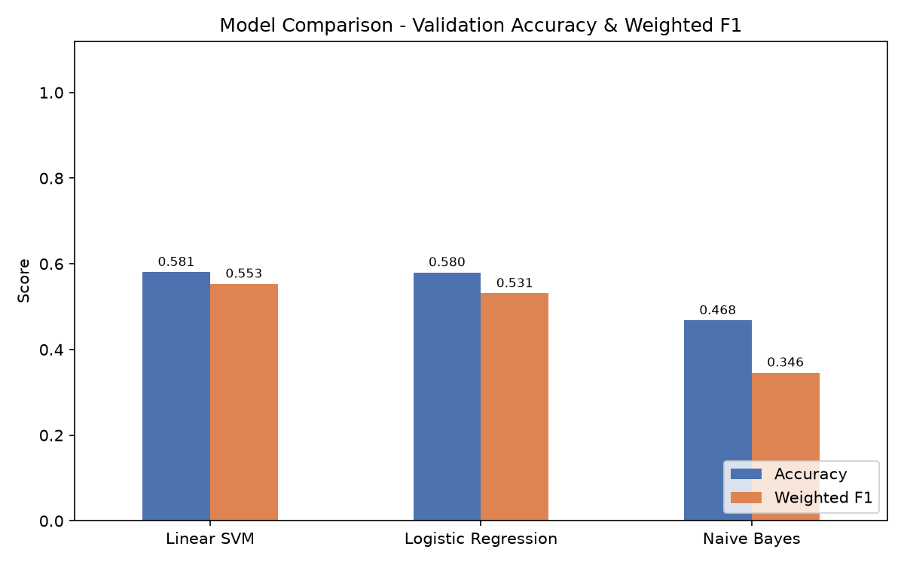
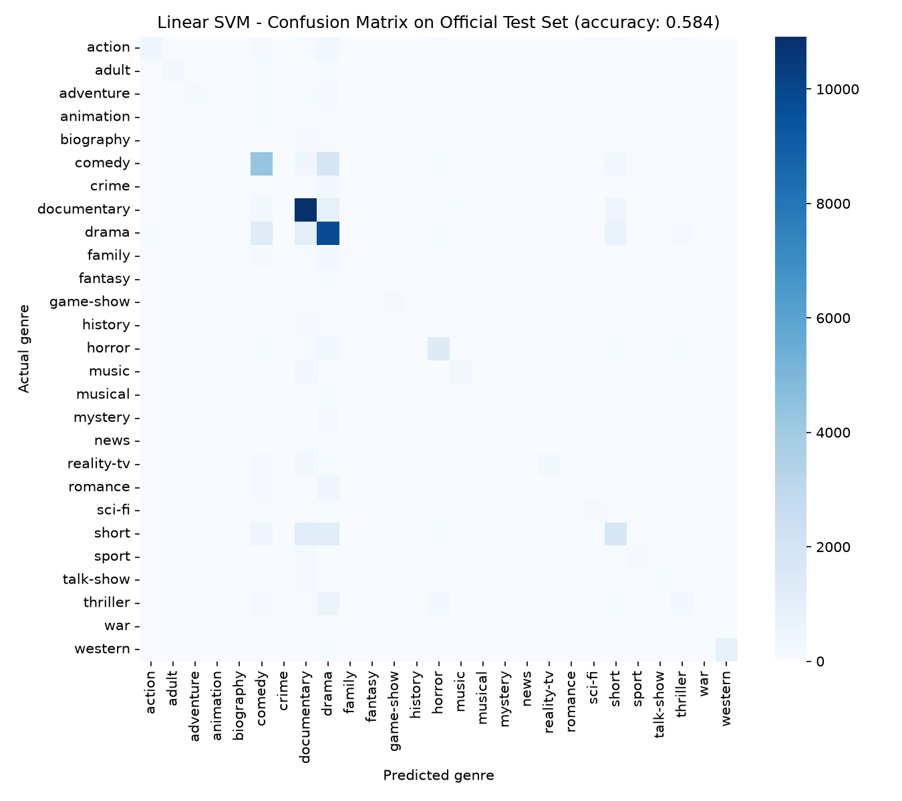

# CODSOFT_TASK1 — Movie Genre Classification 🎬

This repository contains my solution for **Task 1: Movie Genre Classification**,
completed as part of my Machine Learning Internship at **CodSoft**.

## 📌 Task Objective
Build a machine learning model that predicts the **genre of a movie** based on
its **plot summary / description**.

## 📂 Dataset
[Genre Classification Dataset (IMDb) — Kaggle](https://www.kaggle.com/datasets/hijest/genre-classification-dataset-imdb)

Format:
```
train_data.txt  → ID ::: TITLE ::: GENRE ::: DESCRIPTION
test_data.txt   → ID ::: TITLE ::: DESCRIPTION

```

## 🛠️ Approach
1. **Text Cleaning** — lowercasing, removing URLs, punctuation, and numbers.
2. **Feature Extraction** — TF-IDF Vectorization (unigrams + bigrams, 20,000 features).
3. **Model Training** — trained and compared three classifiers:
   - Multinomial Naive Bayes
   - Logistic Regression
   - Linear SVM (LinearSVC)
4. **Evaluation** — accuracy score, classification report, and confusion matrix.
5. **Prediction** — best-performing model used to predict genres on unseen test data.

## 📊 Results
| Model                | Validation Accuracy |
|-----------------------|---------------------|
| Naive Bayes           |0.5004|
| Logistic Regression   |0.5755|
| Linear SVM             |0.5676|

Best model: **_(Logistic Regression)_**




## 🧰 Tech Stack
- Python
- Pandas, NumPy
- Scikit-learn (TF-IDF, Naive Bayes, Logistic Regression, SVM)
- Matplotlib, Seaborn

## 🚀 How to Run
```bash
pip install pandas numpy scikit-learn matplotlib seaborn
python movie_genre_classification.py
```
Make sure `train_data.txt` (and optionally `test_data.txt`) are in the same folder.

## 📁 Repository Structure
```
CODSOFT_TASK1/
│
├── movie_genre_classification.py   # Main script
├── train_data.txt                  # Training dataset
├── test_data.txt                   # Test dataset (optional)
├── model_comparison.png            # Model accuracy comparison chart
├── confusion_matrix.png            # Confusion matrix of best model
├── test_predictions.csv            # Predicted genres for test data
└── README.md                       # Project documentation
```

## 🎥 Demo


## 🙌 Acknowledgements
This project was completed as part of the **CodSoft Machine Learning Internship**.

#codsoft #internship #machinelearning
